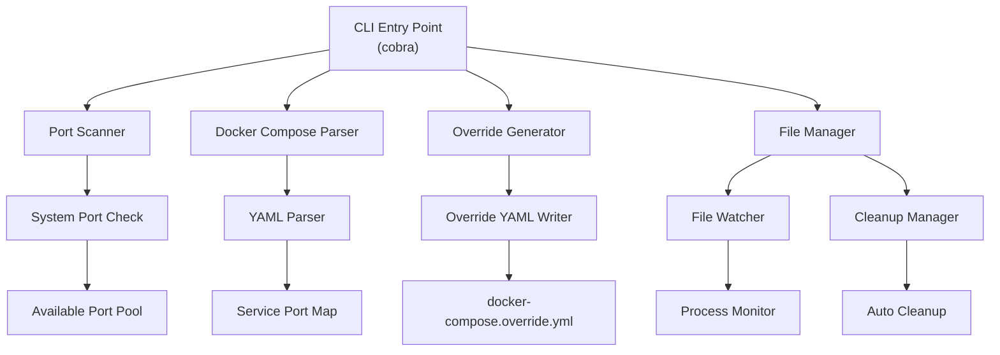
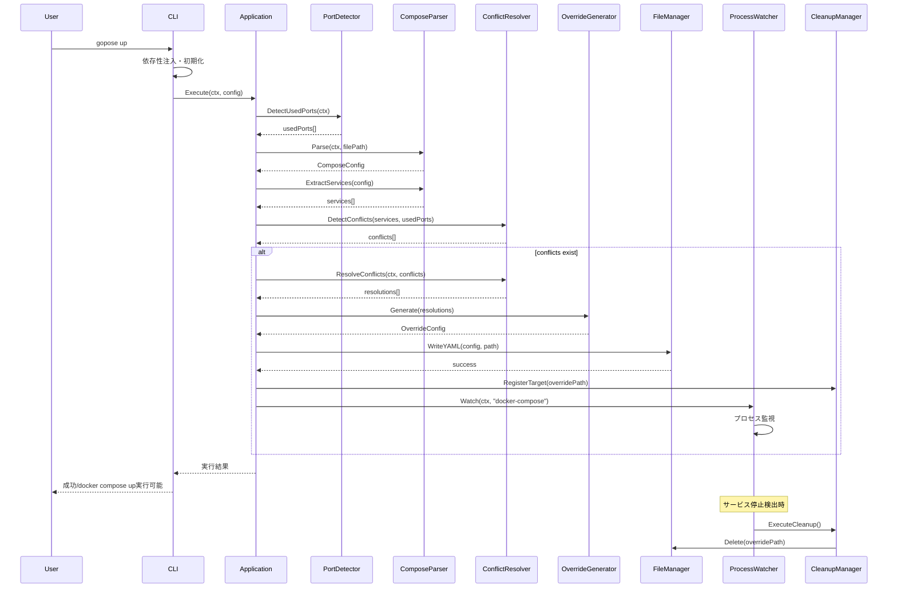

# 設計書: gopose - Docker Compose ポート衝突自動解決ツール

## 1. プロジェクト概要

### プロジェクト名
**gopose** (Go Port Override Solution Engine)

### 目的
- Docker Composeのポートバインディング衝突を自動検出・解決
- 元の`docker-compose.yml`を変更せずに`override.yml`を生成
- ポート衝突解決後、自動的に`override.yml`を削除

### 技術スタック
- **言語**: Go (1.21+)
- **CLI フレームワーク**: Cobra
- **YAML パーサー**: gopkg.in/yaml.v3
- **依存性注入**: Google Wire
- **テストフレームワーク**: Go標準ライブラリ + testify
- **モック生成**: MockGen
- **構造化ログ**: slog (Go 1.21+)
- **設定管理**: Viper
- **ビルドツール**: Make, GoReleaser

## 2. アーキテクチャ設計

### 2.1 システム構成図



### 2.2 コンポーネント設計

#### 2.2.1 メインコンポーネント（SOLIDの原則適用）

1. **CLI Controller** (`cmd/`)
   - Cobraベースのコマンドライン制御
   - サブコマンド管理
   - 依存性注入のエントリーポイント

2. **Port Scanner** (`internal/scanner/`)
   - システムの使用中ポート検出
   - 利用可能ポート範囲の特定
   - プラットフォーム固有の実装を抽象化

3. **Docker Compose Parser** (`internal/parser/`)
   - `docker-compose.yml`の解析
   - サービス・ポート情報の抽出
   - 複数フォーマット対応（YAML/JSON）

4. **Override Generator** (`internal/generator/`)
   - ポート衝突解決ロジック
   - `docker-compose.override.yml`構造生成

5. **File Manager** (`internal/file/`)
   - ファイル操作の抽象化
   - ファイル読み書き・存在確認

6. **Process Watcher** (`internal/watcher/`)
   - Docker Composeプロセス監視
   - プロセス状態変更の検出

7. **Cleanup Manager** (`internal/cleanup/`)
   - 自動クリーンアップロジック
   - リソース管理

8. **Conflict Resolver** (`internal/resolver/`)
   - ポート衝突解決アルゴリズム
   - ポート割り当て戦略

#### 2.2.2 インターフェース設計（SOLIDの原則）

システムの各責任領域に対応したインターフェースを定義し、SOLID原則に従って設計します：

**ポートスキャン関連**
- PortDetector: システムの使用中ポート検出
- PortAllocator: 利用可能ポートの割り当て

**Docker Compose解析関連**
- ComposeParser: Docker Composeファイル解析
- ServiceExtractor: サービス情報抽出
- PortExtractor: ポートマッピング情報抽出

**衝突解決関連**
- ConflictDetector: ポート衝突の検出
- ConflictResolutionStrategy: 解決戦略の策定
- ConflictResolver: 衝突解決の実行
- ResolutionValidator: 解決結果の検証

**ファイル操作関連**
- FileManager: ファイルの基本操作（存在確認、読み書き、削除）
- YAMLWriter: YAML形式でのファイル出力

**プロセス監視関連**
- ProcessWatcher: Docker Composeプロセスの監視
- CleanupManager: 自動クリーンアップの管理

**設定管理関連**
- ConfigLoader: 設定ファイルの読み込み
- PortConfig, FileConfig, WatcherConfig, LogConfig: 責任別設定管理
- Config: 統合設定インターフェース

**ログ・エラーハンドリング関連**
- Logger: 構造化ログ出力
- ErrorHandler: 統一的エラーハンドリング
- Validator: 入力値検証

#### 2.2.3 データ構造

システムで使用する主要なデータ構造を以下のように設計します：

**Docker Compose関連**
- Service: Docker Composeサービスの表現（名前、ポート、依存関係）
- PortMapping: ポートバインディング設定（ホスト・コンテナポート、プロトコル）
- OverrideConfig: override.ymlファイルの構造
- OverrideMetadata: 生成情報とメタデータ

**衝突解決関連**
- Conflict: 検出されたポート衝突（サービス、ポート、衝突タイプ、重要度）
- ResolutionPlan: 衝突解決計画（戦略、優先度、割り当て）
- ConflictResolution: 解決結果（元ポート、新ポート、理由、タイムスタンプ）

**監視・イベント関連**
- ProcessEvent: プロセス状態変更イベント（タイプ、プロセスID、時刻）
- Field: ログフィールド（キー・値ペア）

**設定関連**
- PortRange: ポート範囲設定（開始・終了ポート）
- WatcherConfig: 監視設定（間隔、クリーンアップ遅延）

## 3. 機能仕様

### 3.1 コマンド仕様

**基本コマンド**
- `gopose up`: ポート衝突を検出・解決してDocker Composeを準備
- `gopose clean`: 生成されたoverride.ymlファイルを削除
- `gopose status`: 現在の状態確認

**オプション**
- `-f, --file`: Docker Composeファイル指定
- `--port-range`: 利用するポート範囲指定
- `--verbose`: 詳細ログ出力
- `--config`: 設定ファイル指定

### 3.2 主要機能

#### 3.2.1 ポート衝突検出
- システムの使用中ポート一覧取得
- `docker-compose.yml`のポート設定解析
- 衝突ポートの特定

#### 3.2.2 自動ポート割り当て
- 利用可能ポート範囲からの自動選択
- サービス間の依存関係考慮
- ポート番号の一貫性保持

#### 3.2.3 Override ファイル生成
- 衝突解決用の`docker-compose.override.yml`作成
- 元ファイルの構造保持
- 最小限の変更のみ記述

#### 3.2.4 自動クリーンアップ
- Docker Composeプロセス監視
- サービス停止時の`override.yml`削除
- 一時ファイルの自動管理

## 4. ディレクトリ構造（改善版）

```
gopose/
├── cmd/
│   ├── root.go          # Cobra root command + DI container
│   ├── up.go            # up subcommand
│   ├── clean.go         # clean subcommand
│   ├── status.go        # status subcommand
│   └── wire.go          # 依存性注入設定 (Wire)
├── internal/
│   ├── app/
│   │   ├── application.go # アプリケーションサービス
│   │   └── interfaces.go  # アプリケーション層インターフェース
│   ├── scanner/
│   │   ├── interfaces.go  # ポートスキャン関連インターフェース
│   │   ├── netstat.go     # netstatベース実装
│   │   ├── procnet.go     # /proc/net/tcpベース実装
│   │   └── windows.go     # Windows専用実装
│   ├── parser/
│   │   ├── interfaces.go  # 解析関連インターフェース
│   │   ├── yaml.go        # YAML解析実装
│   │   ├── json.go        # JSON解析実装
│   │   └── extractor.go   # サービス・ポート抽出
│   ├── resolver/
│   │   ├── interfaces.go  # 衝突解決インターフェース
│   │   ├── detector.go    # 衝突検出
│   │   ├── resolver.go    # 衝突解決ロジック
│   │   └── allocator.go   # ポート割り当て
│   ├── generator/
│   │   ├── interfaces.go  # 生成関連インターフェース
│   │   ├── override.go    # override.yml構造生成
│   │   └── validator.go   # 生成内容バリデーション
│   ├── file/
│   │   ├── interfaces.go  # ファイル操作インターフェース
│   │   ├── manager.go     # ファイル管理実装
│   │   └── yaml_writer.go # YAML書き込み実装
│   ├── watcher/
│   │   ├── interfaces.go  # 監視関連インターフェース
│   │   ├── process.go     # プロセス監視実装
│   │   └── docker.go      # Docker監視実装
│   ├── cleanup/
│   │   ├── interfaces.go  # クリーンアップインターフェース
│   │   ├── manager.go     # クリーンアップマネージャー
│   │   └── scheduler.go   # スケジューラー
│   ├── config/
│   │   ├── interfaces.go  # 設定関連インターフェース
│   │   ├── loader.go      # 設定ローダー
│   │   ├── validator.go   # 設定バリデーション
│   │   └── default.go     # デフォルト設定
│   ├── logger/
│   │   ├── interfaces.go  # ログインターフェース
│   │   ├── structured.go  # 構造化ログ実装
│   │   └── console.go     # コンソール出力実装
│   └── errors/
│       ├── types.go       # エラー型定義
│       ├── handlers.go    # エラーハンドラー
│       └── codes.go       # エラーコード定義
├── pkg/
│   ├── types/
│   │   ├── compose.go     # Docker Compose関連型
│   │   ├── port.go        # ポート関連型
│   │   ├── config.go      # 設定関連型
│   │   └── events.go      # イベント関連型
│   └── testutil/
│       ├── mocks/         # モックオブジェクト
│       ├── fixtures/      # テスト用フィクスチャ
│       └── helpers.go     # テストヘルパー
├── test/
│   ├── unit/              # 単体テスト
│   ├── integration/       # 統合テスト
│   ├── e2e/              # E2Eテスト
│   └── testdata/         # テストデータ
├── docs/
│   ├── api/              # API仕様
│   ├── architecture/     # アーキテクチャ図
│   └── examples/         # 使用例
├── scripts/
│   ├── build.sh          # ビルドスクリプト
│   ├── test.sh           # テストスクリプト
│   └── release.sh        # リリーススクリプト
├── deployments/
│   └── docker/           # Docker関連ファイル
├── .github/
│   └── workflows/        # GitHub Actions
├── go.mod
├── go.sum
├── main.go
├── Makefile
└── README.md
```

## 5. 実装フロー

### 5.1 メイン処理フロー（依存性注入適用）



### 5.2 依存性注入とアプリケーション層設計

#### 5.2.1 アプリケーションサービス設計

**レイヤード構造**
- Application層: メインのオーケストレーション
- Service層: 機能別のサービス集約
- Repository層: データアクセス抽象化

**サービス分類**
- PortService: ポート関連操作の集約
- ComposeService: Docker Compose関連操作の集約
- ResolverService: 衝突解決関連操作の集約
- FileService: ファイル関連操作の集約
- WatcherService: 監視関連操作の集約

**実行フロー**
1. 設定検証
2. Docker Compose解析とサービス抽出
3. ポート衝突検出
4. 衝突解決計画策定と実行
5. Override生成・書き込み
6. プロセス監視開始

#### 5.2.2 Wire を使用した依存性注入

**依存性注入の設計方針**
- Google Wireを使用した自動依存性注入
- インターフェースベースの依存関係定義
- プロバイダー関数による設定の分離
- レイヤー別のセット定義

**Wire設定構成**
- ApplicationSet: 全体の依存関係セット
- ドメイン層のプロバイダー: ビジネスロジック関連
- インフラ層のプロバイダー: 外部依存関連
- インターフェースバインディング: 実装の結合

#### 5.2.3 ポート衝突解決アルゴリズム

**衝突検出戦略**
- システム使用中ポートとの比較
- Docker Composeサービス間でのポート重複検出
- 設定されたポート範囲外での使用チェック

**解決戦略**
- 最小変更原則: 必要最小限のポート変更
- 依存関係考慮: サービス間の依存順序を維持
- ポート近接性: 元ポートから近い値を優先選択

**Override生成戦略**
- 変更されたサービスのみ記述
- 元の設定構造を保持
- メタデータによる変更履歴管理

## 6. 設定仕様

### 6.1 設定ファイル仕様

**デフォルト設定**
- ポート範囲: 8000-9999
- Docker Composeファイル: docker-compose.yml
- Overrideファイル: docker-compose.override.yml

**監視設定**
- 監視間隔: 5秒
- クリーンアップ遅延: 30秒

**ログ設定**
- ログレベル: info
- ログファイル: ~/.gopose/logs/gopose.log

## 7. エラーハンドリング

### 7.1 エラー種別

#### 7.1.1 ファイル関連エラー
- `docker-compose.yml`が存在しない
- 権限不足でファイル作成できない

#### 7.1.2 ポート関連エラー
- 利用可能ポートが不足
- 指定範囲外のポート要求

#### 7.1.3 Docker関連エラー
- Docker Composeが利用できない
- 不正なYAML形式

### 7.2 エラー対応（改善版）

#### 7.2.1 エラー型の定義

**エラーコード分類**
- ファイル関連: FILE_NOT_FOUND, FILE_PERMISSION, FILE_INVALID_YAML
- ポート関連: PORT_UNAVAILABLE, PORT_RANGE_INVALID, PORT_CONFLICT
- Docker関連: DOCKER_NOT_FOUND, COMPOSE_INVALID, PROCESS_NOT_FOUND

**AppError構造**
- エラーコード、メッセージ、原因、追加フィールドを含む
- 標準のerrorインターフェースを実装
- エラーラッピングをサポート

**事前定義エラー**
- よく発生するエラーの事前定義
- 一貫したエラーメッセージの提供

#### 7.2.2 エラーハンドリング戦略

**統一エラーハンドリング**
- 全てのエラーをAppErrorに変換
- リトライ可能性の判定
- エラー重要度の分類

**エラー変換ルール**
- OSエラーから適切なAppErrorへの変換
- 既存のAppErrorはそのまま通す
- 不明なエラーは汎用エラーとして扱う

**重要度分類**
- Info: 情報レベル
- Warn: 警告レベル  
- Error: エラーレベル
- Critical: 致命的エラー

#### 7.2.3 リトライ機構

**リトライ設定**
- 最大試行回数の設定
- 遅延時間とバックオフ戦略
- リトライ可能エラーの判定

**バックオフ戦略**
- 指数バックオフ: 遅延時間を指数的に増加
- 線形バックオフ: 遅延時間を線形増加
- 固定遅延: 一定の遅延時間

**リトライ対象**
- 一時的なネットワークエラー
- ファイルロックエラー
- Docker API一時的エラー

## 8. テスト戦略

### 8.1 単体テスト
- 各コンポーネントの独立テスト
- モック使用による外部依存排除

### 8.2 統合テスト
- 実際のDocker環境でのE2Eテスト
- 複数シナリオでの動作確認

### 8.3 テスト戦略（改善版）

#### 8.3.1 単体テスト

**テスト設計方針**
- テーブル駆動テストの採用
- インターフェースを活用したモック作成
- 境界値とエラーケースのテスト

**テスト対象**
- 各コンポーネントの独立テスト
- エラーハンドリングの検証
- 境界条件の確認

**モック戦略**
- インターフェースベースのモック作成
- テストヘルパー関数による設定簡素化
- 依存性注入を活用したテスト環境構築

#### 8.3.2 統合テスト

**統合テスト方針**
- 実際のDocker環境での動作確認
- ファイルシステムとの統合確認
- コンポーネント間の連携テスト

**テスト環境構築**
- テンポラリディレクトリでの実行
- テスト用Docker Composeファイル作成
- 実際の依存関係での動作確認

**検証項目**
- override.ymlファイルの生成確認
- ポート衝突解決の正確性
- 設定ファイルとの連携確認

#### 8.3.3 E2Eテスト

**E2Eテスト目的**
- 完全なワークフローの動作確認
- 実際のDocker環境での検証
- CLIインターフェースのテスト

**テスト前提条件**
- Docker環境の利用可能性確認
- テスト環境の自動セットアップ
- クリーンアップの確実な実行

**検証項目**
- コマンド実行の成功
- 期待される出力メッセージ
- Docker Composeの正常起動

#### 8.3.4 ベンチマークテスト

**パフォーマンステスト目的**
- 大規模環境での性能確認
- ボトルネックの特定
- 性能回帰の検出

**測定対象**
- ポート衝突検出の処理時間
- 大量サービスでの解決時間
- メモリ使用量の測定

#### 8.3.5 テストカバレッジと品質指標

**カバレッジ目標**
- 全体: 90%以上
- 重要なビジネスロジック: 95%以上
- エラーハンドリング: 85%以上

**品質指標**
- 循環的複雑度: 10未満
- コード重複率: 5%未満
- 技術的負債: 1時間未満
- テストカバレッジ: 90%以上

#### 8.3.6 テストデータ管理

**フィクスチャ管理**
- テスト用Docker Composeファイル管理
- ポートマッピングシナリオデータ
- 設定ファイルのテンプレート

**テスト環境**
- テンポラリディレクトリの自動作成
- モックオブジェクトの一元管理
- テスト用アサーション関数

## 9. 実装詳細

### 9.1 ポートスキャン実装

**実装方針**
- プラットフォーム固有の方法を抽象化
- Linux: /proc/net/tcpファイル読み取り
- macOS/Windows: netstatコマンド実行
- 利用可能ポート検索の効率化

### 9.2 Docker Compose解析実装

**解析方針**
- gopkg.in/yaml.v3による構造化解析
- Docker Compose v2/v3フォーマット対応
- ポート形式の多様性対応（文字列/数値/range）
- 依存関係の抽出と順序管理

### 9.3 Override生成実装

**生成方針**
- 最小限の差分のみ記述
- 元のCompose構造を保持
- メタデータによる変更履歴管理
- 原子的ファイル書き込みによる安全性確保

## 10. 今後の拡張性

### 10.1 機能拡張案
- 複数のDocker Composeファイル対応
- ネットワーク設定の自動調整
- 環境変数の動的設定
- Web UIでの状態監視

### 10.2 プラットフォーム対応
- Windows/Linux/macOS対応
- CI/CD環境での利用
- Kubernetes環境への展開

### 10.3 パフォーマンス最適化（詳細版）

#### 10.3.1 並列処理の活用
- **並列ポートスキャン**: Goroutineを使用した複数ポート範囲の同時スキャン
- **並列設定検証**: 複数設定項目の並列バリデーション
- **並列ファイル処理**: 複数ファイルの同時読み書き

#### 10.3.2 キャッシュ戦略
```go
type CacheService interface {
    GetUsedPorts(ctx context.Context, ttl time.Duration) ([]int, error)
    CacheUsedPorts(ctx context.Context, ports []int, ttl time.Duration)
    GetComposeConfig(ctx context.Context, filePath string, modTime time.Time) (*ComposeConfig, error)
    CacheComposeConfig(ctx context.Context, filePath string, config *ComposeConfig, modTime time.Time)
}

// メモリベースキャッシュ実装
type MemoryCacheService struct {
    mu     sync.RWMutex
    cache  map[string]CacheEntry
    maxSize int
}
```

#### 10.3.3 増分更新対応
- **差分検出**: 前回実行との差分のみ処理
- **ファイル監視**: ファイル変更時のみ再解析
- **キャッシュ無効化**: 必要最小限のキャッシュクリア

#### 10.3.4 リソース使用量最適化
- **メモリ使用量**: 大規模Composeファイルでのメモリ効率化
- **CPU使用量**: ポートスキャンのCPU効率化
- **I/O最適化**: ファイル読み書きの最適化

## 11. セキュリティ考慮事項

### 11.1 ファイルアクセス制御
- 適切なファイル権限設定
- 一時ファイルの安全な管理

### 11.2 ポート範囲制限
- 特権ポート（1-1023）の除外
- ユーザー定義範囲の検証

### 11.3 プロセス監視
- 権限昇格の防止
- 安全なプロセス終了

## 12. 運用・保守

### 12.1 ログ管理
- 構造化ログ出力
- ログローテーション
- デバッグ情報の適切な出力

### 12.2 設定管理
- 設定ファイルのバリデーション
- デフォルト値の適切な設定
- 環境変数による設定上書き

### 12.3 監視・アラート
- ヘルスチェック機能
- 異常状態の検出
- 自動復旧機能

## 13. 実装計画とマイルストーン

### 13.1 Phase 1: 基盤構築（2週間）
- [ ] プロジェクト構造の作成
- [ ] 依存関係管理（go.mod, Wire設定）
- [ ] 基本インターフェースの定義
- [ ] ログ機能とエラーハンドリングの実装
- [ ] 設定管理の実装

### 13.2 Phase 2: コア機能実装（3週間）
- [ ] ポートスキャン機能の実装
- [ ] Docker Compose解析機能の実装
- [ ] 衝突検出・解決ロジックの実装
- [ ] Override生成機能の実装
- [ ] 単体テストの作成

### 13.3 Phase 3: 統合・監視機能（2週間）
- [ ] ファイル管理機能の実装
- [ ] プロセス監視機能の実装
- [ ] 自動クリーンアップ機能の実装
- [ ] 統合テストの作成

### 13.4 Phase 4: CLI・UX改善（1週間）
- [ ] Cobraベースのコマンドライン実装
- [ ] ユーザーフレンドリーなメッセージ出力
- [ ] プログレス表示機能
- [ ] E2Eテストの作成

### 13.5 Phase 5: パフォーマンス・リリース準備（1週間）
- [ ] パフォーマンステスト・最適化
- [ ] ドキュメント整備
- [ ] CI/CD設定
- [ ] リリースパッケージング

## 14. SOLID原則の適用まとめ

### ✅ 改善された点

1. **単一責任の原則 (SRP)**
   - File Manager を File Manager、Process Watcher、Cleanup Manager に分離
   - 各コンポーネントが明確な単一責任を持つ

2. **開放閉鎖の原則 (OCP)**
   - インターフェースベースの設計により、実装の拡張が容易
   - プラットフォーム固有の実装を抽象化

3. **リスコフの置換原則 (LSP)**
   - 小さく特化したインターフェースにより、実装の置き換えが安全

4. **インターフェース分離の原則 (ISP)**
   - 大きなインターフェースを小さく特化したものに分離
   - クライアントが不要な依存関係を持たない

5. **依存性逆転の原則 (DIP)**
   - Google Wireを使用した依存性注入
   - 高レベルモジュールが低レベルモジュールに依存しない

### 🎯 アーキテクチャの利点

- **テスタビリティの向上**: インターフェースベースによりモック作成が容易
- **保守性の向上**: 責任の分離により変更の影響範囲が限定される
- **拡張性の向上**: 新機能追加時に既存コードの修正が最小限
- **可読性の向上**: 明確な責任分離により理解しやすいコード

---

この改善された設計書は、SOLIDの原則を厳密に適用し、保守性・拡張性・テスタビリティに優れたDocker Composeポート衝突解決ツール「gopose」の実装指針を提供します。 
