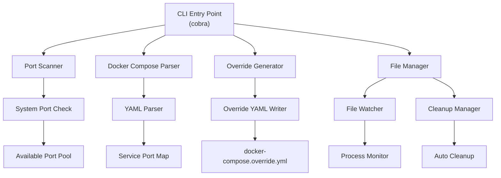

# gopose - Docker Compose ポート衝突自動解決ツール

<div align="center">
  
  
  [](https://golang.org/)
  [](LICENSE)
  [](https://goreportcard.com/report/github.com/harakeishi/gopose)
</div>

## 概要

**gopose** (Go Port Override Solution Engine) は、Docker Compose のポートバインディング衝突を自動検出・解決するツールです。

元の `docker-compose.yml` を変更せずに `docker-compose.override.yml` を生成し、ポート衝突解決後、自動的に `override.yml` を削除します。

### 🎯 主な特徴

- ✅ **非破壊的**: 元の `docker-compose.yml` ファイルを変更しません
- ✅ **自動検出**: システムの使用中ポートとの衝突を自動検出
- ✅ **自動解決**: 利用可能なポートを自動割り当て
- ✅ **自動クリーンアップ**: プロセス終了時に `override.yml` を自動削除
- ✅ **SOLID原則**: 保守性と拡張性を考慮した設計
- ✅ **構造化ログ**: 詳細なログ出力とデバッグ機能
- ✅ **クロスプラットフォーム**: Linux、macOS、Windows対応
- ✅ **並列処理**: ポートスキャンを並列で実施

## インストール

### ソースからビルド

```bash
git clone https://github.com/harakeishi/gopose.git
cd gopose
make build
sudo make install
```

## 使用方法

### 基本的な使用方法

```bash
# ポート衝突を検出・解決してDocker Composeを準備
gopose up

# 生成されたoverride.ymlファイルを削除
gopose clean

# 現在の状態確認
gopose status
```

### 高度な使用方法

#### ファイル指定とポート範囲設定

```bash
# 特定のファイルを指定
gopose up -f custom-compose.yml

# ポート範囲を指定
gopose up --port-range 9000-9999

# 複数のポート範囲を指定
gopose up --port-range 8000-8999,9000-9999
```

#### 除外設定

```bash
# 特定のサービスを除外
gopose up --exclude-services redis,postgres

# 特権ポートを除外
gopose up --exclude-privileged

# 予約ポートを除外
gopose up --exclude-ports 8080,8443,9000
```

#### 監視とクリーンアップ設定

```bash
# 監視間隔を設定
gopose up --watch-interval 10s

# クリーンアップ遅延を設定
gopose up --cleanup-delay 60s

# 自動クリーンアップを無効化
gopose up --no-auto-cleanup
```

#### 出力とログ設定

```bash
# ドライラン（実際の変更は行わない）
gopose up --dry-run

# 詳細ログ出力
gopose up --verbose

# 詳細情報を含めて表示
gopose up --detail # タイムスタンプやフィールドを含めて表示

# JSON形式で状態確認
gopose status --output json

# ログレベルを設定
gopose up --log-level debug
```

### 設定ファイル

設定ファイル（`.gopose.yaml`）をホームディレクトリまたはプロジェクトディレクトリに配置できます：

```yaml
port:
  range:
    start: 8000
    end: 9999
  reserved: [8080, 8443, 9000, 9090]
  exclude_privileged: true

file:
  compose_file: "docker-compose.yml"
  override_file: "docker-compose.override.yml"
  backup_enabled: true

watcher:
  interval: "5s"
  cleanup_delay: "30s"

log:
  level: "info"
  format: "text"
  file: "~/.gopose/logs/gopose.log"

resolver:
  strategy: "minimal_change"  # minimal_change, sequential, random
  preserve_dependencies: true
  port_proximity: true
```

### 出力例

```
[info] Docker Compose ファイルを解析中: docker-compose.yml
[info] サービス一覧:
  - web (ポート: 8080 -> 80)
  - api (ポート: 8080 -> 3000)  # 衝突検出
  - redis (ポート: 6379 -> 6379)
  - postgres (ポート: 5432 -> 5432)

[warn] ポート衝突を検出しました:
  - ポート 8080: web, api サービス間で衝突

[info] 衝突解決中...
  - api サービスのポート 8080 -> 8081 に変更

[info] docker-compose.override.yml を生成しました
[info] Docker Compose プロセスを監視中...

[info] 解決されたポートマッピング:
  web: 8080 -> 80
  api: 8081 -> 3000  # 自動解決
  redis: 6379 -> 6379
  postgres: 5432 -> 5432

[success] ポート衝突が解決されました。docker compose up を実行できます。
```


## アーキテクチャ

本プロジェクトはSOLID原則に基づいて設計されており、以下の特徴があります：

### 設計原則

- **単一責任の原則 (SRP)**: 各コンポーネントが明確な単一責任を持つ
- **開放閉鎖の原則 (OCP)**: インターフェースベースで拡張できる設計
- **リスコフの置換原則 (LSP)**: 実装の置き換えが安全
- **インターフェース分離の原則 (ISP)**: 小さく特化したインターフェース
- **依存性逆転の原則 (DIP)**: Google Wireを使用した依存性注入

### システム構成図



### 主要コンポーネント

#### ポートスキャン関連
- **PortDetector**: システムの使用中ポート検出
- **PortAllocator**: 利用可能ポートの割り当て

#### Docker Compose解析関連
- **ComposeParser**: Docker Composeファイル解析
- **ServiceExtractor**: サービス情報抽出
- **PortExtractor**: ポートマッピング情報抽出

#### 衝突解決関連
- **ConflictDetector**: ポート衝突の検出
- **ConflictResolver**: 衝突解決の実行
- **ResolutionValidator**: 解決結果の検証

#### ファイル操作関連
- **FileManager**: ファイルの基本操作
- **YAMLWriter**: YAML形式でのファイル出力

#### プロセス監視関連
- **ProcessWatcher**: Docker Composeプロセスの監視
- **CleanupManager**: 自動クリーンアップの管理

## ディレクトリ構造

```
gopose/
├── cmd/                 # CLIコマンド
│   ├── root.go         # Cobra root command + DI container
│   ├── up.go           # up subcommand
│   ├── clean.go        # clean subcommand
│   ├── status.go       # status subcommand
│   └── wire.go         # 依存性注入設定 (Wire)
├── internal/           # 内部実装
│   ├── app/           # アプリケーション層
│   ├── scanner/       # ポートスキャン
│   ├── parser/        # Docker Compose解析
│   ├── resolver/      # 衝突解決
│   ├── generator/     # Override生成
│   ├── file/          # ファイル操作
│   ├── watcher/       # プロセス監視
│   ├── cleanup/       # 自動クリーンアップ
│   ├── config/        # 設定管理
│   ├── logger/        # ログ機能
│   └── errors/        # エラーハンドリング
├── pkg/               # 公開パッケージ
│   ├── types/         # 型定義
│   └── testutil/      # テストユーティリティ
├── test/              # テスト
│   ├── unit/          # 単体テスト
│   ├── integration/   # 統合テスト
│   └── e2e/           # E2Eテスト
├── docs/              # ドキュメント
├── scripts/           # スクリプト
└── deployments/       # デプロイメント設定
```

## 開発

### 開発環境セットアップ

```bash
# リポジトリをクローン
git clone https://github.com/harakeishi/gopose.git
cd gopose

# 依存関係のインストール
make deps

# 開発用ビルド
make dev

# テスト実行
make test

# コード品質チェック
make check
```

### Make タスク

```bash
# ビルド
make build              # 通常ビルド
make build-all          # 全プラットフォーム向けビルド
make dev                # 開発用ビルド

# テスト
make test               # 全テスト実行
make test-unit          # 単体テスト
make test-integration   # 統合テスト
make test-e2e           # E2Eテスト
make test-coverage      # カバレッジ生成

# コード品質
make fmt                # コードフォーマット
make lint               # リンター実行
make vet                # go vet実行
make check              # 全チェック実行

# 開発
make run                # 実行
make clean              # クリーンアップ
make deps               # 依存関係インストール

# リリース
make release            # リリースビルド
make docker-build       # Dockerイメージビルド
```

### テスト

```bash
# 全テスト実行
go test ./...

# カバレッジ付きテスト
go test -race -coverprofile=coverage.out ./...

# ベンチマークテスト
go test -bench=. ./...

# 特定のテストのみ実行
go test -run TestPortScanner ./internal/scanner/
```

## 将来のCI/CD & デプロイメント計画

将来的には完全自動化されたCI/CDパイプラインを導入し、コード品質管理から自動リリースまでを自動化する予定です。

### 🔄 計画中の継続的インテグレーション (CI)

- **マルチバージョンテスト**: Go 1.21, 1.22, 1.23 での検証
- **テスト実行**: レース条件検出付きテスト
- **カバレッジ測定**: Codecovへの自動アップロード
- **マルチプラットフォームビルド**: Linux、macOS、Windows用バイナリ生成

### 🚀 計画中の自動リリース

**自動バージョニング**:
- **メジャーバージョン** (`v1.0.0 → v2.0.0`): `feat!:` で始まるコミットまたは `BREAKING CHANGE` を含む
- **マイナーバージョン** (`v1.0.0 → v1.1.0`): `feat:` で始まるコミット
- **パッチバージョン** (`v1.0.0 → v1.0.1`): その他のコミット (`fix:`, `refactor:` など)

### 📦 計画中のリリース成果物

- クロスプラットフォーム対応バイナリ
- Dockerコンテナイメージ
- Go modulesでのインストール対応
- 自動生成ドキュメント

## コントリビューション

プルリクエストやイシューの報告を歓迎します！

### 開発ガイドライン

1. **フォーク**してローカルに開発環境を構築
2. **機能ブランチ**を作成 (`git checkout -b feature/amazing-feature`)
3. **変更をコミット** (`git commit -m 'feat: 新しい機能を追加'`)
4. **ブランチにプッシュ** (`git push origin feature/amazing-feature`)
5. **プルリクエスト**を作成

### コミットメッセージ規約

[Conventional Commits](https://www.conventionalcommits.org/) に従ってください：

- `feat:` 新機能
- `fix:` バグ修正
- `docs:` ドキュメント更新
- `style:` コードスタイル変更
- `refactor:` リファクタリング
- `test:` テスト追加・修正
- `chore:` その他の変更

### 設計書

アーキテクチャの理解を深めるために、[DESIGN.md](DESIGN.md) を参照してください。

## ライセンス

このプロジェクトは [MIT License](LICENSE) の下で公開されています。

## ロードマップ

### 🎯 現在の進捗

- [x] **Phase 1: 基盤構築** ✅
  - [x] プロジェクト構造の作成
  - [x] 依存関係管理（go.mod, Wire設定）
  - [x] 基本インターフェースの定義
  - [x] ログ機能とエラーハンドリングの実装
  - [x] 設定管理の実装

- [ ] **Phase 2: コア機能実装** 🚧
  - [x] ポートスキャン機能の実装
  - [x] Docker Compose解析機能の実装
  - [ ] 衝突検出・解決ロジックの実装
  - [ ] Override生成機能の実装
  - [ ] 単体テストの作成

- [ ] **Phase 3: 統合・監視機能**
  - [ ] ファイル管理機能の実装
  - [ ] プロセス監視機能の実装
  - [ ] 自動クリーンアップ機能の実装
  - [ ] 統合テストの作成

- [ ] **Phase 4: CLI・UX改善**
  - [ ] Cobraベースのコマンドライン実装
  - [ ] ユーザー向けのメッセージ出力
  - [ ] プログレス表示機能
  - [ ] E2Eテストの作成

- [ ] **Phase 5: パフォーマンス・リリース準備**
  - [ ] パフォーマンステスト・最適化
  - [ ] ドキュメント整備
  - [ ] CI/CD設定
  - [ ] リリースパッケージング

### 🚀 将来の機能

- [ ] **Web UI**: ブラウザベースの状態監視
- [ ] **Kubernetes対応**: K8sマニフェストのポート衝突解決
- [ ] **ネットワーク設定**: 自動ネットワーク調整
- [ ] **プラグインシステム**: カスタム解決戦略
- [ ] **クラウド統合**: AWS/GCP/Azure環境での利用

詳細な実装計画は [DESIGN.md](DESIGN.md) を参照してください。

---

<div align="center">
  <p>Developed by <a href="https://github.com/harakeishi">harakeishi</a></p>
  <p>
    <a href="https://github.com/harakeishi/gopose/issues">🐛 バグ報告</a> •
    <a href="https://github.com/harakeishi/gopose/discussions">💬 ディスカッション</a> •
    <a href="https://github.com/harakeishi/gopose/wiki">📖 Wiki</a>
  </p>
</div>
